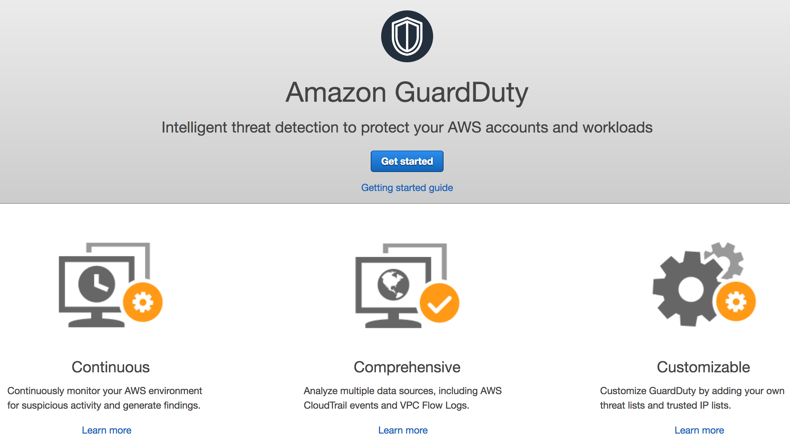
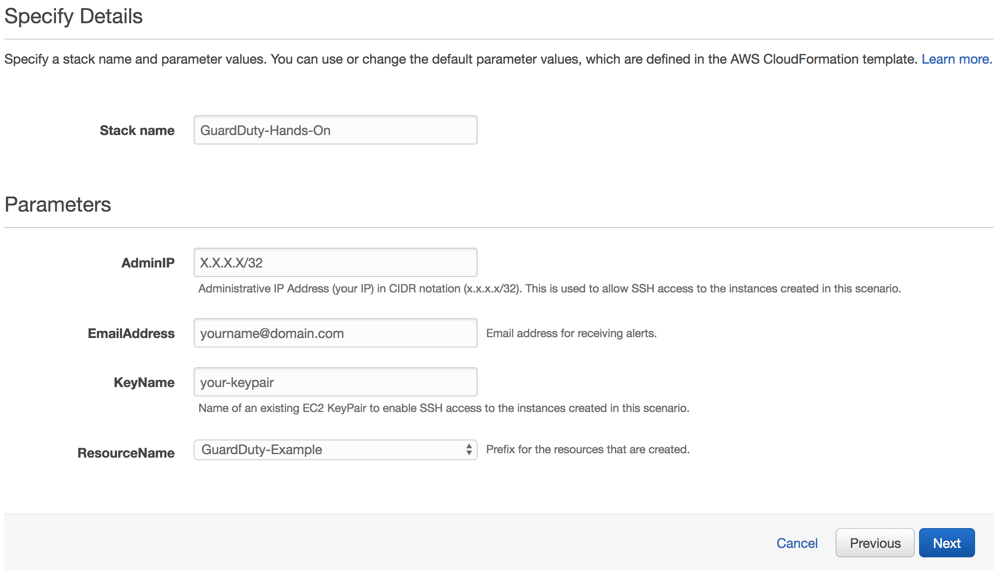
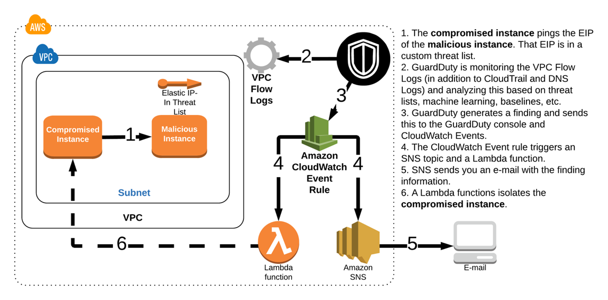
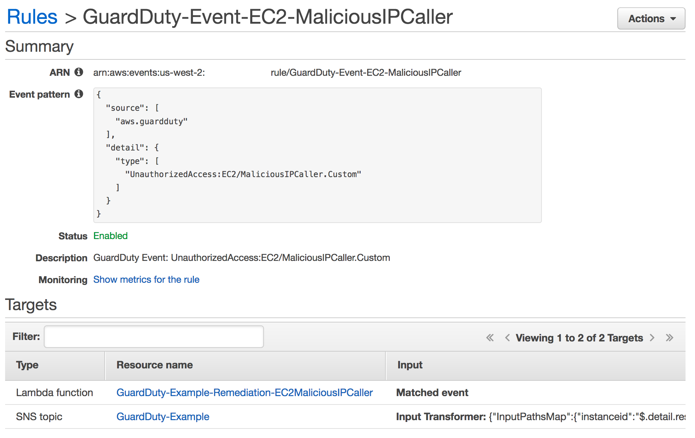
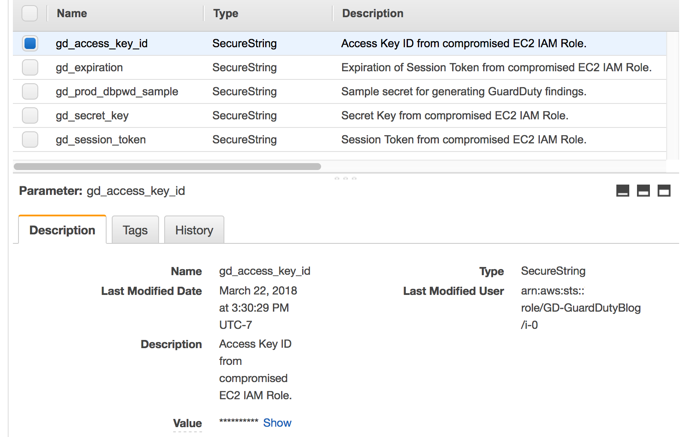

# Getting Hands On with Amazon GuardDuty

This repository walks you through a scenario covering threat detection and remediation using [Amazon GuardDuty](https://aws.amazon.com/guardduty/); a managed threat detection service. The scenario simulates an attack that spans a few threat vectors, representing just a small sample of the threats that GuardDuty is able to detect. In addition, we look at how to view and analyze GuardDuty findings, how to send alerts based on the findings, and, finally, how to remediate findings. The [AWS CloudFormation](https://aws.amazon.com/cloudformation/) template used for this scenario builds out the resources needed to simulate attacks and auto-remediate the GuardDuty findings using a combination of [CloudWatch Event Rules](https://docs.aws.amazon.com/AmazonCloudWatch/latest/events/WhatIsCloudWatchEvents.html) and [AWS Lambda Functions](https://aws.amazon.com/lambda/).  

> Ensure you are using an AWS IAM User with Admin privileges for this scenario.

### Table of Contents

* [Getting Started](#started) 
* [Deploy the Environment](#deploy) 
* [Scenario 1 – Compromised EC2 Instance](#attack1) 
* [Scenario 2 – Compromised IAM Credentials](#attack2)
* [Scenario 3 – IAM Role Credential Exfiltration](#attack3)
* [Clean Up](#cleanup)

## Getting Started – Just Two Clicks <a name="started"/>

Follow these steps to enable GuardDuty:

> Please use the **Oregon (us-west-2)** region.  Skip this step if you already have GuardDuty enabled in this region.  You can run this in other regions but the CloudFormation deploy button currently defaults to us-west-2 so adjust accordingly if you do not want to use this region.

1. **First Click**: Navigate to the GuardDuty console in the region you want to run this scenario in and then click **Get Started**.



2. **Second Click**: On the next screen click **Enable GuardDuty**.


### Data Sources

That is all you need to do. There are no prerequisites you need to set up, no agents to install, and no hardware to configure. From the moment you enable GuardDuty it begins analyzing all of the VPC Flow Logs, CloudTrail logs, and DNS Query Logs (these are generated from the default DNS resolver in your VPCs and are not available to customers) in that region. GuardDuty accesses all of these [data sources](https://docs.aws.amazon.com/guardduty/latest/ug/guardduty_data-sources.html) without any of them having to be enabled; although it is a best practice to enable CloudTrail and VPC Flow Logs for your own analysis. Regardless of the number of VPCs, IAM users, or other AWS resources in your account, there is no impact to your resources because all of the processing is being done within the managed service. 
 


### Findings

Now that GuardDyty is enabled it is actively monitoring the three data sources for malicious or unauthorized behavior as it relates to your EC2 instances and AWS IAM Principals.  You should be taken directly to the **Findings** tab which will show finding details as GuardDuty detects them. After deploying the scenario, you will start to see GuardDuty findings being detected.  Each finding is broken down into the format below to allow for a concise yet readable description of potential security issues.

**ThreatPurpose : ResourceTypeAffected / ThreatFamilyName . ThreatFamilyVariant ! Artifact**

> Click [here](https://docs.aws.amazon.com/guardduty/latest/ug/guardduty_finding-types.html) for a complete description each part.

There are certain findings that will require a baseline (7 - 14 days) to be established so GuardDuty is able to understand regular behavior and identity anomalies. An example of a finding that requires a baseline would be if an EC2 instance started communicating with a remote host on an unusual port or an IAM User who has no prior history of modifying Route Tables starts making modifications.  All of the findings generated in these scenarios will be based on signatures, so the findings will be detected 10 minutes after the completion of the CloudFormation stack.  The delay is due to the amount of time it takes for the information about a threat to appear in one of the log files and the time GuardDuty is able to detect the finding.

> Click [here](https://docs.aws.amazon.com/guardduty/latest/ug/guardduty_finding-types.html) for a complete list of current GuardDuty finding types. 

## Deploy the Environment <a name="deploy"/>

To initiate the scenarios and begin generating GuardDuty findings you need to run the provided CloudFormation template. Given that you will be simulating attacks and doing remediations, you should run the CloudFormation template in a non-production account. After running through this scenario, you can look at how you can implement GuardDuty and associated remediations in a multi-account structure so you are able to aggregate findings from other accounts and use the service in a more productionized manner. 

Region| Deploy
------|-----
US West 2 (Oregon) | [](https://console.aws.amazon.com/cloudformation/home?region=us-west-2#/stacks/new?stackName=GuardDuty-Hands-On&templateURL=https://s3-us-west-2.amazonaws.com/sa-security-specialist-workshops-us-west-2/guardduty-hands-on/guardduty-cfn-template.yml)

1.  Click the **Deploy to AWS** button above.  This will automatically take you to the AWS Management Console to run the template (in us-west-2).  If you prefer, you can also just use the template found in this repo (guardduty-cfn-template.yml).
2.  On the **Specify Details** section enter the necessary parameters as shown below. 
    
3.  Once you have entered your parameters click **Next**, then **Next** again \(leave everything on this page at the default\).
4.  Finally, acknowledge the template will create IAM roles and click **Create**.  This will bring you back to the CloudFormation console. You can refresh the page to see the stack starting to create.
5.  You will get an email from SNS asking you to confirm the Subscription. Confirm this so you can receive email alerts from GuardDuty.

The initial findings will begin to show up in GuardDuty about 10 minutes after the CloudFormation stack creation completes. 

### What is Created?

The CloudFormation template will create the following resources:
  * Three [Amazon EC2](https://aws.amazon.com/ec2/) Instances (all using a t2.micro instance type)
    * Two Instances that contain the name “*Compromised Instance*”
    * One instance that contains the name “*Malicious Instance*”
  * [AWS IAM Role](https://docs.aws.amazon.com/IAM/latest/UserGuide/id_roles.html) For EC2 which will have permissions to SSM Parameter Store and DynamoDB
  * One [Amazon SNS Topic](https://docs.aws.amazon.com/sns/latest/dg/GettingStarted.html) so you will be able to receive notifications
  * Three [AWS CloudWatch Event](https://docs.aws.amazon.com/AmazonCloudWatch/latest/events/WhatIsCloudWatchEvents.html) rules for triggering the appropriate notification or remediation
  * Two [AWS Lambda](https://aws.amazon.com/lambda/) functions that will be used for remediating findings and will have permissions to modify Security Groups and revoke active IAM Role sessions (on only the IAM Role associated with this scenario)
  * [AWS Systems Manager Parameter Store](https://docs.aws.amazon.com/systems-manager/latest/userguide/systems-manager-paramstore.html) values with the IAM temporary security credentials details (only used to easily retrieve credentials for the purposes of this scenario).

> Make sure the CloudFormation stack is in a **CREATE_COMPLETE** status before moving on.

## Scenario 1 – Compromised EC2 Instance <a name="attack1"/>

You are simulating an attack scenario so let’s set the scene: 

### Scene Simulation

After an uneventful yet unnecessarily long commute to work, you arrived at the office on Monday morning. You grabbed a cup of coffee, sat down in your cube, opened up your laptop and begin to go through your emails. Soon after you begin though you start receiving emails indicating that GuardDuty has detected new threats. You don’t yet know the extent of the threats but you quickly begin to investigate. Now the good news is that your coworker Alice has already set up some hooks for specific findings so that they will be automatically remediated. 

The first email you receive from GuardDuty indicates that one of your EC2 instances might be compromised:

*GuardDuty Finding | ID: 1xx: The EC2 instance i-xxxxxxxxx might be compromised and should be investigated*

Shortly after the first email, you receive a second email indicating that the same GuardDuty finding has been remediated:

*GuardDuty Remediation | ID: 1xx: GuardDuty discovered an EC2 instance (Instance ID: i-xxx) that is communicating outbound with an IP Address on a threat list that you uploaded.  All security groups have been removed and it has been isolated. Please follow up with any additional remediation actions.*

### Diagram of the Attack, Detection, and Remediation



### Browse to the GuardDuty Console to Investigate

When Alice setup the hook for notifications she only included certain information about the finding because she had also setup a Lambda function to automatically isolate the instance and send out the details of the remediation.  Since the finding has been remediated you decide you still want to take a closer look at the setup Alice currently has in place.

1.	Navigate to the [GuardDuty console](https://console.aws.amazon.com/guardduty) and click on **Findings** in the navigation pane on the left. 
	> If there is nothing displayed click the refresh button.
    
2.	A finding should show up with the text **UnauthorizedAccess:EC2/MaliciousIPCaller.Custom**. 
	> Based on the format you reviewed earlier can you determine the security issue by the finding type?

	

The finding type indicates that an EC2 instance in your environment is communicating outbound to an IP address included on a [custom threat list]. Click on **Lists** in the left navigation to view your current white lists and threat lists.

> GuardDuty uses managed threat intelligence provided by AWS Security and third party providers, such as ProofPoint and CrowdStike. You can expand the monitoring scope of GuardDuty by configuring it to use your own custom trusted IP lists and threat lists.

**Scenario Notes:** 
	*	The EC2 instance indicated by this finding is actually just connecting to an [Elastic IP](https://docs.aws.amazon.com/AWSEC2/latest/UserGuide/elastic-ip-addresses-eip.html) (EIP) on another instance in the same VPC to keep with the scenario localized to your environment. The CloudFormation template automatically created the threat list and added the EIP for the malicious instance to the list.
	* 	Another option, that may better align with your incident response plans, would be to notify the security team and allow them to investigate before any action is taken. A timer could be set to allow investigation before an automated action is taken.  This way a determination as to what action to take could be made based on the results of the investigation of the reported threat.

### View the CloudWatch Event Rule
  
Alice used CloudWatch Event Rules to send the email you received about the findings and also to take remediations steps. Examine the CloudWatch Events console to understand what Alice configured and to see how the remediation was triggered. 

1.	Navigate to the [CloudWatch console](https://us-east-2.console.aws.amazon.com/cloudwatch/home?) and then, on the left, under the **Events** section, click **Rules**. You will see three Rules in the list that were created by the CloudFormation template. All of these begin with the prefix “*GuardDuty-Event*."

	

2.	Click on the rule named **GuardDuty-Event-EC2-MaliciousIPCaller**. 

	

	Under the **Targets** section you will see two entries, one for a Lambda function and one for an SNS Topic.  The CloudWatch Event Rule publishes the finding to the SNS Topic which in turn sends out an email notification.  Rather than sending the entire JSON event you can see how she customized the email by using an **[input transformer](https://docs.aws.amazon.com/AmazonCloudWatch/latest/events/CloudWatch-Events-Input-Transformer-Tutorial.html)**.

### View the Remediation Lambda Function

The Lambda function is what handles the remediation logic for this finding. Alice setup the Lambda function to remove the compromised instance from its current security group and add it to one with no ingress or egress rules so that the instance is isolated from the network. Click the **Resource Name** for the Lambda function to evaluate the remediation logic.


Scroll down to view the code for this function (walking through the code logic is outside the scope of this scenario). You can also click the **Monitoring** tab and view the invocation of the function. You should see one invocation Count and no Invocation Errors. 

> What permissions does the Lambda Function need to perform the remediation?

### Verify that the Remediation was Successful

Next, double check the effects of the remediation to ensure the instance is isolated.

1.	Browse to the [EC2 console](https://us-east-2.console.aws.amazon.com/ec2/v2) and click **Running Instances**. You should see three instances with names that begin with **GuardDuty-Example**.

    
2.  Click on the instance named **GuardDuty-Example: Compromised Instance: Scenario 1**.  
3.  Under the **Description** tab verify the instance was the Security Group with a name that starts with **GuardDutyBlog-ForensicSecurityGroup**.

    Initially, all three of the instances launched by the CloudFormation template were in the Security Group that starts with the name **GuardDutyBlog-TargetSecurityGroup-**. The Lambda function removed this one instance from the TargetSecurityGroup and added it to the ForensicsSecurityGroup to isolate the instance. 
4. Click on the **GuardDutyBlog-ForensicSecurityGroup** and view the ingress and egress rules.

>	What additional information would be useful in the notifications?

## Scenario 2 – Compromised IAM Credentials (Simulated) <a name="attack2"/>

You have completed the examination of this first attack, confirmed it was properly remediated, and then sat back to take your first sip of coffee for the day when you notice an additional email about new findings. The first of the new findings indicates that an API call was made using IAM credentials from your AWS account from a malicious IP address. 

> **Scenario Note**: None of your IAM credentials have actually been compromised or exposed in any way. The finding is the result of an EC2 instance using an IAM Role for EC2 and with an EIP that is in the custom threat list making API calls on your behalf. 

### Diagram of the Simulated Attack and Detection


### Browse to the GuardDuty Console to investigate

To view the findings:

1. Navigate to the [GuardDuty console](https://console.aws.amazon.com/guardduty) and then, in the navigation pane on the left, choose **Current**. 
2.	Click the   icon to refresh the GuardDuty console. You should now see additional findings that related to **Recon:IAMUser** and **UnauthorizedAccess:IAMUser**. Each GuardDuty finding is broken down into a format (**[ThreatPurpose:ResourceTypeAffected/ThreatFamilyName.ThreatFamilyVariant!Artifact](https://docs.aws.amazon.com/guardduty/latest/ug/guardduty_finding-types.html#type-format)**) that allows for a concise yet readable description of a potential security issue. Click on one of the findings to view the full details. Below is a screenshot of one example showing a partial view of the finding details.

    

    You can see the finding details include information about what happened, what AWS resources were involved in the suspicious activity, when this activity took place, and other additional information.  Under **Resource Affected**, find the name of AWS IAM **User Name** associated with this finding.

This finding indicates that the IAM credentials (of the user you found above) are possibly compromised because API calls using those credentials are being made from an IP address on a custom threat list.  Similar to the compromised EC2 instance finding, Alice set up a CloudWatch Event Rule for this finding that we will examine now.

>	**Scenario Note**: All of these findings showing up after the initial “*UnauthorizedAccess:EC2/MaliciousIPCaller.Custom*” are regarding IAM access key compromises. These IAM findings are being generated by the “malicious EC2” instance making API calls. These API calls generate findings because the EIP of that instance is in a custom threat list.

### View the CloudWatch Event rule for the compromised IAM credential

1.	Navigate to the [CloudWatch console](https://us-east-2.console.aws.amazon.com/cloudwatch/home?) and then, on the left, under the **Events** section, click **Rules**.

2.	You will see three Rules in the list that were created by the CloudFormation template each beginning with the phrase “*GuardDuty-Event*” (you might see other rules depending on if any other rules were created for other purposes.) 
3.	The rule that Alice configured for this “compromised access key” scenario is called “*GuardDuty-Event-EC2-MaliciousIPCaller*”. Click that rule. 
4.	Under the **Targets** section, you will see a rule for an SNS Topic. The SNS topic entry was responsible for sending an email to the email address you entered in the parameters for the CloudFormation template. You can see this SNS Topic Trigger also has a transformation filter to modify the email to make it more user friendly.
5.	Alice did not set up a Lambda function to remediate this threat because the decision by the security team was to manually investigate and remediate this particular type of finding. 


There could be an investigative phase before an action is taken, including disabling the IAM Credential or the revoking the IAM Role session. This is also where a third-party solution could be examined. In many customer use cases, we have seen CloudWatch Events are used to send findings to an existing customer’s SIEM. Many [Amazon GuardDuty partners](https://aws.amazon.com/guardduty/resources/partners/) already have solutions for GuardDuty to make ingestion simple, help with analysis of findings, and also to help set up remediations. Some of these remediation options use Lambda, so instead of a CloudWatch Event Rule triggering Lambda, the solution itself could trigger a workflow which would include Lambda taking action.

## Attack Scenario 3 – IAM Role Credential Exfiltration <a name="attack3"/>

We will look at one final threat that Alice anticipated. For the previous attack we mentioned that the EC2 Instance was making API calls using the temp credentials from an IAM Role for EC2. Alice wanted to monitor for and remediate the situation where IAM temporary security credentials are copied (stolen) from an EC2 instance and used from a system external to the AWS network. She has already created the CloudWatch Events rule and Lambda function for this remediation. This vector will require you to take some manual steps in order to trigger it, though (which, of course, will reduce the effectiveness of the illusion that this is an actual attack scenario.) The manual action you take will result in GuardDuty generating a High Severity finding and is an interesting threat because it indicates that an unusual and potentially serious event is occurring. 

To produce this finding, you will need to copy the IAM temporary security credentials from the EC2 instance (or from the Parameters in AWS Systems Manager where the CloudFormation template has copied the IAM temporary security credentials  information) and make API calls from your laptop (the calls need to come from outside the AWS network). 

### Retrieve the IAM temporary security credentials from the EC2 instance

To simulate this last and final attack you will need to retrieve the IAM temporary security credentials  generated by the IAM Role for EC2. You will need to copy these credentials to your laptop and then set up a local AWS CLI profile. You can retrieve the credentials by either [connecting to the instance via SSH](https://docs.aws.amazon.com/AWSEC2/latest/UserGuide/AccessingInstancesLinux.html) and querying the [instance metadata](https://docs.aws.amazon.com/AWSEC2/latest/UserGuide/ec2-instance-metadata.html) or you can find the credentials in the Parameter store of AWS Systems Manager. On startup, the EC2 instance with the credentials exported them to the Parameter Store. This allows you to easily retrieve them without connecting to the instance. Below are instructions for retrieving the credentials from the Parameter Store:

Finding the Credentials in the Parameter Store:
1. Open the [EC2 console](https://console.aws.amazon.com/ec2)
2. In the navigation pane on the left, scroll all the way to the bottom and click **Parameter Store**
3. You should see three parameters: *gd_access_key_id*, *gd_secret_key*, and *gd_session_token*. As shown below, click the parameters and, on the **Description** tab, click **Show** to decrypt and view the secret.



### Create a new AWS CLI profile on your laptop to use the IAM temporary credentials 

Now that you have retrieved the IAM temporary security credentials you will need to copy them to your computer (this can be your laptop or another system that is not within an AWS environment) and add them to an AWS CLI profile. There are a number of ways to do this, but below are some commands to help get you started:

From a command prompt, run the following commands (replace the variables with your credentials):
```
aws configure set profile.attacker.region <region>
aws configure set profile.attacker.aws_access_key_id <gd_access_key>
aws configure set profile.attacker.aws_secret_access_key <gd_secret_key>
aws configure set profile.attacker.aws_session_token <gd_session_token>
```

If you view your local aws credentials file, you should now see an [attacker] profile with the stolen IAM temporary credentials.

### Run commands using the IAM temporary credentials

Now that you have your named profile you can use it to make API calls. Use the commands below to query different services to see what you have access to (don't be surprised if you see some access denied responses):

**Let's see if we have any IAM permissions:**
```
aws iam get-user --profile attacker

aws iam create-user --user-name Chuck --profile attacker
```

**What about DynamoDB?**
```
aws dynamodb list-tables --profile attacker

aws dynamodb describe-table --table-name GuardDuty-Example-Customer-DB --profile attacker
```

**Can we query the data?**
```
aws dynamodb scan --table-name GuardDuty-Example-Customer-DB --profile attacker

aws dynamodb put-item --table-name GuardDuty-Example-Customer-DB --item '{"name":{"S":"Joshua Tree"},"state":{"S":"Michigan"},"website":{"S":"https://www.nps.gov/yell/index.htm"}}' --profile attacker

aws dynamodb scan --table-name GuardDuty-Example-Customer-DB --profile attacker

aws dynamodb delete-table --table-name GuardDuty-Example-Customer-DB --profile attacker

aws dynamodb list-tables --profile attacker
```

**Do you have access to Systems Manager Parameter Store?**
```
aws ssm describe-parameters --profile attacker

aws ssm get-parameters --names "gd_prod_dbpwd_sample" --profile attacker

aws ssm get-parameters --names "gd_prod_dbpwd_sample" --with-decryption --profile attacker

aws ssm delete-parameter --name "gd_prod_dbpwd_sample" --profile attacker
```

You can make other calls to see what you have access to with those credentials.

### View the Lambda function designed to remediate this finding

You should eventually see alerts sent to your email and findings will show up in the [GuardDuty console](https://console.aws.amazon.com/guardduty) for [UnauthorizedAccess:IAMUser/InstanceCredentialExfiltration](http://docs.aws.amazon.com/guardduty/latest/ug/guardduty_finding-types.html#unauthorized11). The alert for this threat will have a high severity. In addition, Alice set up a remediation for this threat that we will now examine.

Go to the [Lambda console](https://console.aws.amazon.com/lambda) and review the function named **GuardDuty-Example-Remediation-InstanceCredentialExfiltration**.

To verify that the **InstanceCredentialExfiltration** finding was remediated, you can run one of the CLI commands you ran earlier (for example, *aws dynamodb list-tables --profile attacker*). You should see a response that states that there is an explicit deny for that action. This is because the remediation Lambda Function attaches a policy to the EC2 IAM Role that revokes all active sessions. You can view this policy within IAM under the Role.  You should also receive a follow-up email saying the Role credentials have been revoked.

## Cleanup <a name="cleanup"/>

To remove the assets created by the CloudFormation, follow these steps: 
1. Delete the S3 bucket that was created by the CloudFormation template (it will have a name that begins with “*guardduty-example*”).  This needs to be done because data was put in the bucket and CloudFormation will not allow you to delete a bucket with data in it.
2. Delete the compromised instance IAM Role (it will have a name that begins with "*GD-*" and ends with the name of your CloudFormation stack). Because one of the Lambda functions added an additional policy to this Role you need to manually delete this.
3. Delete the custom Threat List within GuardDuty.  Within the GuardDuty console under **Settings** click **Lists**.  From there delete the "*Example-Threat-List*".
4. Delete the CloudFormation Stack created for this blogpost. If you see any errors, it means you didn't delete the S3 Bucket or IAM role in the previous steps.   

## License Summary

This sample code is made available under a modified MIT license. See the LICENSE file.
